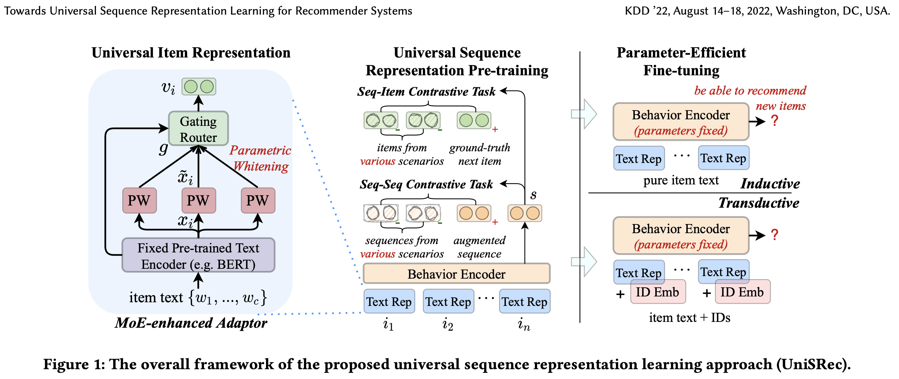

UniSRec - Unified Sequential Recommendation
===

## Introduction

**UniSRec** is an advanced recommendation framework designed to address sequential recommendation problems by unifying multiple methods like SASRec and cold-start/warm-start techniques. This repository provides example code for pretraining, finetuning, and inference workflows for building scalable recommendation systems.



---

## Features

1. **Modular Design**:
   - Separate pretrain, finetune, and inference pipelines.
   - Flexible configurations via YAML files.
2. **Cold-Start and Warm-Start Support**:
   - In-process directories for targeted optimization.
3. **Advanced Models**:
   - Integration with SASRec and UniSRec architectures.
4. **Preprocessing and Postprocessing**:
   - Utilities for data preparation and reranking.

---

## Directory Structure 

```
.
├── LICENSE
├── README.md
├── cloudbuild.yaml
├── configs 
│   ├── SASRec.yaml
│   ├── Sequential.yaml
│   ├── UniSRec.yaml
│   ├── finetune.yaml
│   ├── inference.yaml
│   └── pretrain.yaml
├── data
│   ├── finetune
│   ├── fixed
│   ├── inference
│   └── pretrain
├── datasets
│   ├── __init__.py
│   ├── samplers
│   │   └── seq_sampler.py
│   └── unisrec.py
├── environment.yml
├── images
│   ├── SASRec.png
│   └── UniSRec.png
├── inprocess 
│   ├── coldstart
│   │   └── inference.py
│   └── warmstart
│       ├── finetune.py
│       ├── inference.py
│       └── pretrain.py
├── models // SASRec and UniSRec Implementation
│   ├── README.md
│   ├── __init__.py
│   ├── sasrec.py
│   └── unisrec.py
├── kubeflow // Pipeline Scripts
│   ├── coldstart.py
│   ├── finetune.py
│   ├── inference.py
│   ├── preprocess.py
│   ├── pretrain.py
│   └── rerank.py
├── postprocess 
│   ├── __init__.py
│   ├── caching.py
│   └── erank.py
├── preprocess
│   ├── README.md
│   ├── __init__.py
│   ├── base_data_proc.py
│   ├── finetune_data_proc.py
│   ├── inference_data_proc.py
│   └── pretrain_data_proc.py
├── trainer
│   └── unisrec.py
└── utils 
    └── __init__.py
```

---

## Installation

1. Clone the repository:
   ```bash
   git clone https://github.com/yeyuting0307/UniSRec.git
   cd UniSRec
   ```

2. Install dependencies:
   ```bash
   conda env create -f environment.yml
   conda activate unisrec
   ```

3. Configure the YAML files in the `configs` folder as needed.

4. Customize your data loading and processing scripts in the `datasets`, `preprocess`.

5. Customize the pipeline scripts in the `kubeflow` folder.

---

## Usage 
The project is designed to be run on Kubeflow Pipelines on Google Cloud Platform. The following steps outline the workflow for running the preprocessing, pretraining, finetuning, and inference pipelines.

### Preprocessing
```bash
python kubeflow/preprocess.py
```

### Pretraining
```bash
python kubeflow/pretrain.py
```

### Finetuning
```bash
python kubeflow/finetune.py 
```

### Inference
```bash
python kubeflow/inference.py
```

### Reranking
```bash
python kubeflow/rerank.py
```

---
## Reference

【Warm-Start】

[《Towards Universal Sequence Representation Learning for Recommender Systems》](https://arxiv.org/abs/2206.05941)


[《Self-Attentive Sequential Recommendation》](https://arxiv.org/abs/1808.09781)


【Cold-Start】

[《Large Language Model Simulator for Cold-Start Recommendation》](https://arxiv.org/abs/2402.09176)

[《Large Language Models as Data Augmenters for Cold-Start Item Recommendation》](https://arxiv.org/abs/2402.11724)

---

## Contribution 

Contributions are welcome! Feel free to open issues or submit pull requests.

---

## License

This project is licensed under the MIT License. See the LICENSE file for details.

---


